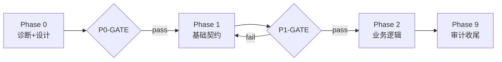

<!--
TEMPLATE-NOTE
模板来源：knowledge-graph 4 月 secmgr 系列 plan 的成熟形态抽象
派生原则：plan-as-collaboration-contract（plan 即协作契约）
承载规则：plan-execution-guide.mdc + plan-architecture-navigation.mdc

填空说明：
- 凡 <<< ... >>> 包裹的内容均为占位符，必须替换
- 凡以 <!-- TEMPLATE-NOTE: ... --> 开头的注释为指引，使用前请删除
- 表格内的「示例行」请删除或改写
- TODO 数量按实际任务调整，但每 Phase 必须有一个 GATE TODO

适用 Phase 数：3-7（少于 3 不需要模板，多于 7 应拆分为多个 plan）
适用 TODO 数：10-40（多于 40 应分阶段建多个 plan）
-->

---
name: <<< 项目名_做什么 >>>
overview: "<<< 一句话总览：为什么做、改什么、约多少 Phase + 多少 TODO + 预估工作日 >>>"
todos:
  # =========================================
  # Phase 0：诊断 + 设计（PROBE 主导）
  # =========================================
  - id: P0-1
    content: "P0-1: PROBE <<< 诊断什么 >>>。[PROBE → docs/audit/<<<诊断文档名>>>.md] [全程Opus] ⚠️首读：(1) <<<具体路径1>>> (2) <<<具体路径2>>> (3) <<<具体路径3>>>。禁止<<<反模式>>>。"
    status: pending

  - id: P0-2
    content: "P0-2: DOC <<< 写什么设计文档 >>>。[DOC → docs/<<<设计文档路径>>>.md] [全程Opus] [前置: P0-1] ⚠️首读：(1) P0-1 落盘文档 (2) <<<相关本体/合同路径>>>。"
    status: pending

  - id: P0-GATE
    content: "P0-GATE: 文档评审 + 编译验证。[GATE] [Fast可胜任] <<<编译命令>>>。0 errors 后方可进入 Phase 1。"
    status: pending

  # =========================================
  # Phase 1：基础数据/契约层（EXEC 实施）
  # =========================================
  - id: P1-1
    content: "P1-1: TEST <<< 写哪些契约测试，先红 >>>。[EXEC test-only] [全程Opus] [前置: P0-GATE] ⚠️首读：(1) P0-1 落盘 (2) P0-2 设计文档。落盘：<<<测试文件路径>>>。"
    status: pending

  - id: P1-2
    content: "P1-2: EXEC 按 P1-1 红测试补齐缺口。[EXEC] [Opus→Fast搬运] [前置: P1-1] ⚠️首读：P1-1 测试断言期望 + <<<待修改的实现文件>>>。"
    status: pending

  - id: P1-GATE
    content: "P1-GATE: <<<编译命令 + 测试命令 + 业务回归命令>>>。[GATE] [Fast可胜任]"
    status: pending

  # =========================================
  # Phase 2~N：业务逻辑层（按需扩展）
  # =========================================
  # <<< 按实际任务复用 P1 的"先 TEST 后 EXEC 后 GATE"三步骨架 >>>

  # =========================================
  # 最终 Phase：完成度审计 + 文档收尾
  # =========================================
  - id: P9-1
    content: "P9-1: DOC 完成度审计 + 联动更新现有规范文档（标注本次治理已完成）。[DOC → docs/audit/<<<完成度审计文档>>>.md] [全程Opus] [前置: 所有 EXEC 完成]。"
    status: pending

  - id: P9-GATE
    content: "P9-GATE: 全量回归 <<<最终验证命令>>>。[GATE] [Fast可胜任]。"
    status: pending

isProject: false
---

# Plan: <<< 项目标题 >>>

<!-- TEMPLATE-NOTE: 以下 6 段为 plan body，完整反映 plan-architecture-navigation 三段契约要素 + 实战补充 -->

## 一、目标与现状基线

<!-- TEMPLATE-NOTE: 多目标场景用 G1/G2/... 矩阵；单目标可省 -->

| 目标层 | 内涵 | 现状（事实+来源） | 缺口 |
|:---|:---|:---|:---|
| G1 <<< 目标 1 >>> | <<< 该目标内涵 >>> | <<< 现状事实 + [文档路径](路径) 来源 >>> | <<< 缺什么 >>> |
| G2 <<< 目标 2 >>> | <<< 该目标内涵 >>> | <<< 现状事实 + 来源 >>> | <<< 缺什么 >>> |

> 现状栏必须含**事实+来源**，不能写"已经实现了 X" 而不附文件路径——参见 plan-execution-guide H-6 硬约束。

## 二、契约级规格（plan-architecture-navigation 行为 0.1）

<!-- TEMPLATE-NOTE: 当 plan 涉及多个同类组件（适配器、模块、字段类型等）时必填映射表 -->

### <<< 规格表标题，如"字段类型 × 引擎契约矩阵" >>>

| <<<键列>>> | <<<契约维度1>>> | <<<契约维度2>>> | <<<契约维度3>>> |
|:---|:---|:---|:---|
| <<<键值1>>> | <<<具体契约>>> | <<<具体契约>>> | <<<具体契约>>> |
| <<<键值2>>> | <<<具体契约>>> | <<<具体契约>>> | <<<具体契约>>> |

### <<< 关键设计决策（如有方案 A vs B）>>>

```yaml
# <<<决策示例的 YAML/伪代码>>>
```

> 如果已有持久化的注册表文档（如 `adapter-registry.md`），此处直接引用而非重复内容：
> ```
> 契约级规格：见 docs/domain/<<<注册表路径>>>.md
> ```

## 三、影响范围（行为 0.2）

| 范畴 | 影响 |
|:---|:---|
| 后端 | <<< 哪些 Service / Controller / Entity / Mapper 受影响；新建哪些测试 >>> |
| 前端 | <<< 哪些组件 / 页面 / schema 受影响 >>> |
| 数据 | <<< schema-v2.sql / data-v2.sql 改哪段，重灌前必读 known-issues >>> |
| 元数据 | <<< model.yaml / enum-master-registry.yaml / ref-objects.yaml 改哪段 >>> |
| 文档 | <<< 哪些设计文档需要新建/更新 >>> |
| 大盘 / 跨域 | <<< 是否影响态势大盘、是否触发跨域副作用 >>> |

### 0.2.b grep 自检触发

<!-- TEMPLATE-NOTE: 当 plan 涉及"字段废弃 / 重命名 / SQL 约束语义变更 / 字典枚举变更 / API 路径变更"任一时必填 -->

本 plan 涉及 <<< 哪类变更 >>>。按 plan-architecture-navigation 0.2.a，必须 grep 全部 docs/：

```bash
grep -rni "<<<旧关键词>>>" docs/ --include="*.md" --include="*.yaml"
```

GATE 通过标准：命中数 = 0，或全部命中均已加修复说明。

## 四、设计文档指向（行为 0.3）

| 现有文档 | 用途 |
|:---|:---|
| [<<<文档名>>>](docs/<<<路径>>>.md) | <<<本 plan 中扮演什么角色>>> |
| [<<<本体文档>>>](docs/domain/<<<子域>>>/ontology-extracted.md) | <<<本 plan 引用本体的哪段>>> |

新建文档清单（落地后回到 P9-1 审计）：

| 待新建文档 | 由哪个 TODO 落盘 | 用途 |
|:---|:---|:---|
| docs/<<<新文档路径>>>.md | P0-2 | <<<用途>>> |

## 五、Phase 流程图

<!-- TEMPLATE-NOTE: 可选；当 Phase 间有非线性依赖时强烈推荐 -->



## 六、回滚策略

| 失败 Phase | 回滚操作 | 副作用 |
|:---|:---|:---|
| Phase 1 GATE 失败 | `git revert` Phase 1 commits + drop database 重灌 | 本地数据丢失，无生产影响 |
| Phase 2 GATE 失败 | <<<具体回滚命令>>> | <<<副作用>>> |
| 全部失败需要放弃 | <<<最终回滚命令 + 通知谁>>> | <<<对其他 plan 的影响>>> |

## 七、关联 derivation（可选但推荐）

<!-- TEMPLATE-NOTE: 标注本 plan 是哪些设计决策的产物，便于未来溯源。本字段在 frontmatter 暂未规范化，先用 body 段承载 -->

- 本 plan 来自 derivation：[`<<<设计决策推导文件名>>>.md`](../../knowledge-graph/meta/derivation/<<<推导文件>>>.md)
- 本 plan 完成后产出的认知将回流到：`meta/derivation/<<<本 plan 的复盘推导>>>.md`
